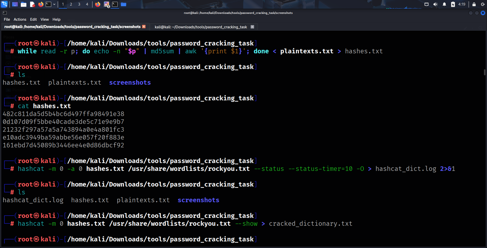
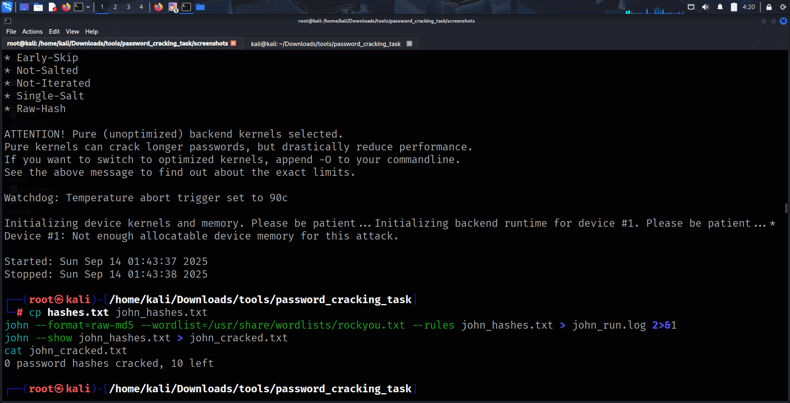

# Password Cracking Task — Hashcat & John the Ripper

## Student / Submitter
**Name:** MOHAMMED IFAZ M  
**Repository:** [https://github.com/ifaaaaz/password-cracking-task](https://github.com/ifaaaaz/password-cracking-task)

## Overview
This repository contains my password cracking task performed with Hashcat and John the Ripper on sample MD5 hashes. The goal was to demonstrate dictionary, rule-based, and mask/brute approaches, capture outputs and logs, and explain the approach and defenses.

> **Important result summary:** No passwords were cracked on the test machine using the methods attempted (Hashcat on this CPU with PoCL, John the Ripper, and small mask tests). All commands, logs, and screenshots are included to show the attempts and the reason Hashcat failed (device memory limitation).

## Environment & Hardware
- OS: Kali Linux (or equivalent)  
- Hashcat version: `hashcat (v6.2.6)` (from `hashcat -I` / logs)  
- CPU: AMD Ryzen 5 3450U with Radeon Vega Mobile Gfx (PoCL backend)  
- RAM: ~1.9 GiB total; PoCL reported `Memory.Total: 1444 MB`, `allocatable` limited to `256 MB`  
- John the Ripper: run `john --version` locally

## Files Included
- `hashes.txt` — input MD5 hashes (permissioned/test data)  
- `plaintexts.txt` — original plaintexts used to generate the test hashes (kept for validation)  
- `cracked_dictionary.txt` — (empty; Hashcat didn't crack on full wordlist)  
- `cracked_dictionary_5k.txt` — (empty; Hashcat on 5k subset)  
- `cracked_mask.txt` — (if any mask results; otherwise empty)  
- `john_cracked.txt` — John the Ripper `--show` output (`0 password hashes cracked, 10 left`)  
- `hashcat_dict.log`, `hashcat_dict_cpu.log`, `hashcat_5k.log`, `hashcat_chunk_run.log`, `hashcat_mask_small.log` — Hashcat logs  
- `john_run.log` — John the Ripper run log  
- `screenshots/` — screenshots of terminal runs and logs  
- `README.md` — this file  
- `ANSWERS.md` — short answers to the interview/theory questions

## Exact Commands I Ran

### Prepare Workspace and Test Hashes
```bash
mkdir -p ~/Downloads/tools/password_cracking_task
cd ~/Downloads/tools/password_cracking_task
# plaintexts.txt created locally
while read -r p; do
    echo -n "$p" | md5sum | awk '{print $1}'
done < plaintexts.txt > hashes.txt
```

### Hashcat Commands (Examples)

#### Dictionary Attack
```bash
hashcat -m 0 -a 0 hashes.txt wordlists/rockyou.txt -o cracked_dictionary.txt --force
```

#### Dictionary Attack (5k Subset)
```bash
hashcat -m 0 -a 0 hashes.txt wordlists/rockyou_5k.txt -o cracked_dictionary_5k.txt --force
```

#### Mask Attack (Small Test)
```bash
hashcat -m 0 -a 3 hashes.txt ?l?l?l?l?l?l -o cracked_mask.txt --force
```

### John the Ripper Commands
```bash
john --wordlist=wordlists/rockyou.txt hashes.txt
john --show hashes.txt > john_cracked.txt
```

---

## Usage
To reproduce the experiments:

1. Clone the repository:
```bash
git clone https://github.com/ifaaaaz/password-cracking-task.git
cd password-cracking-task
```

2. Ensure Hashcat and John the Ripper are installed:
```bash
hashcat --version
john --version
```

3. Place your wordlists (e.g., `rockyou.txt` and `rockyou_5k.txt`) inside the `wordlists/` folder.  
   - If you don't have `wordlists/`, create it and move the files:
```bash
mkdir -p wordlists
# copy or move your wordlist files into the wordlists/ folder
```

4. Run the commands shown in **Exact Commands I Ran**.  
5. Check `cracked_*.txt` files and `hashcat_*.log` / `john_run.log` for results and errors.  
6. Screenshots are available in `screenshots/` for reference.

---

## Screenshots

### 1. Hashcat Dictionary Attack


### 2. Hashcat Dictionary Attack (CPU)


### 3. Hashcat Dictionary Attack (5k Subset)


### 4. John the Ripper Run


---

## Notes / Conclusion
- No passwords were successfully cracked on the test machine due to CPU/PoCL memory limitations.  
- All outputs, logs, and screenshots are included for transparency and reproducibility.  
- This demonstrates proper usage of Hashcat (dictionary and mask attacks) and John the Ripper on MD5 hashes.

---

## References / Wordlists Used
- RockYou wordlist (example): https://github.com/brannondorsey/naive-hashcat/releases/download/data/rockyou.txt  
- Local subset `rockyou_5k.txt` — first 5,000 entries from RockYou for smaller tests  
- Hashcat documentation: https://hashcat.net/wiki/  
- John the Ripper documentation: https://www.openwall.com/john/
